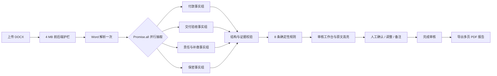
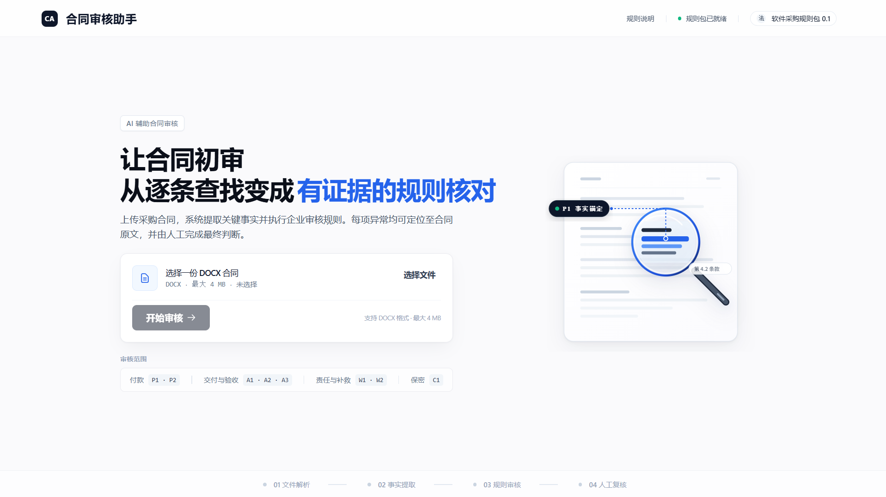
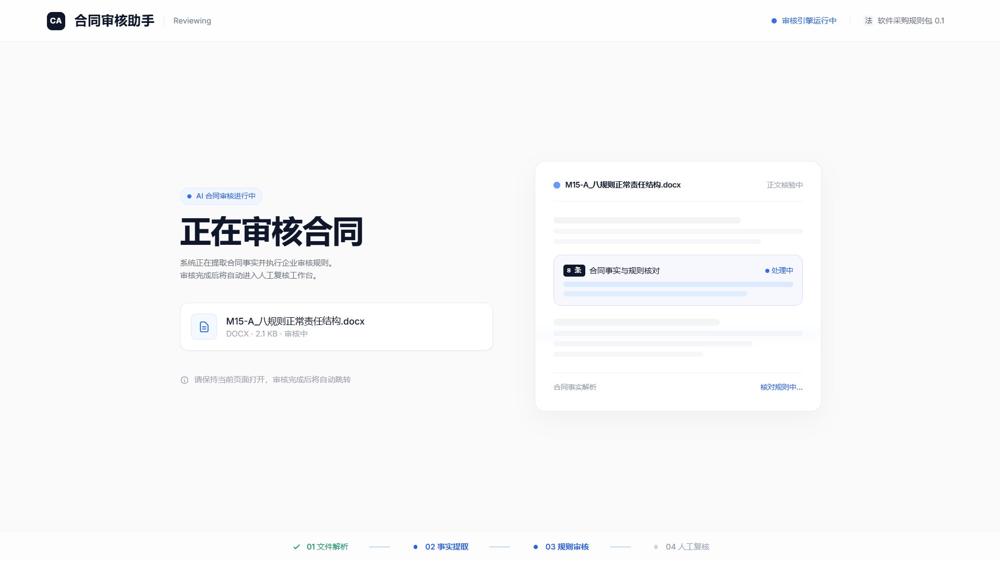
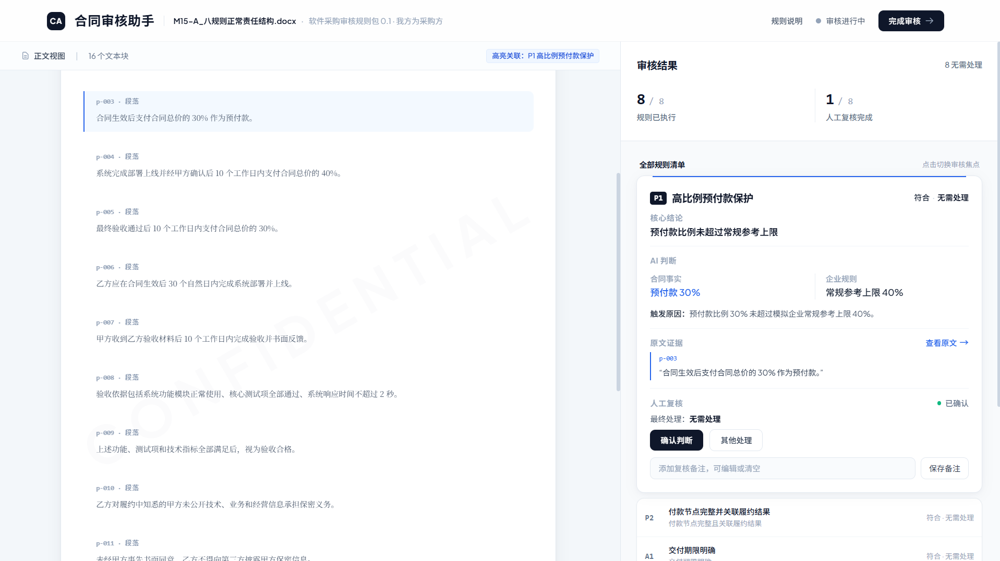
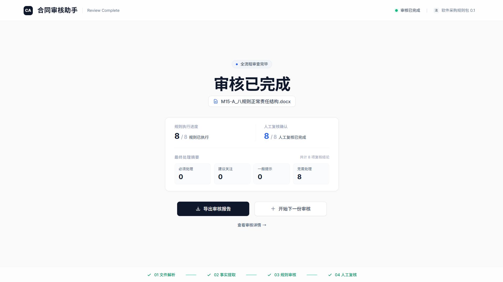
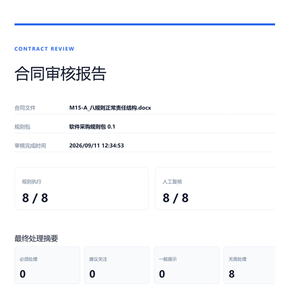

# 合同审核助手

面向企业采购合同初审场景的 AI 辅助审核产品。系统读取 DOCX 合同，由模型提取规则所需的原子事实及其证据引用，再通过 TypeScript 确定性规则执行 8 条企业审核规则，最后把系统审核判断、合同证据与人工复核结果汇总为可导出的 PDF 报告。

> 当前规则包是为产品验证构建的“软件采购规则包 0.1”。输出表示合同是否符合该模拟企业规则，不构成法律意见、法律合规判断或合同可签署结论。

## Live Demo

[体验公开 Demo](https://contract-review-assistant-demo.vercel.app/)

公开 Demo 使用冻结示例数据，不调用真实模型 API，可直接体验审核、原文定位、人工复核和 PDF 报告完整流程。

## 项目资料

- [查看示例审核报告](docs/sample-review-report.pdf)
- [查看产品级评测说明](docs/evaluation.md)
- [查看审核规则包说明](docs/rule-pack.md)

## 项目亮点

- **完整审核闭环**：DOCX 上传 → AI 事实抽取 → 规则判断 → 原文定位 → 人工复核 → PDF 报告。
- **4 个并行事实组**：一次解析合同后，并行抽取付款、交付验收、责任与补救、保密事实。
- **模型与规则分工清晰**：模型只负责理解合同语言并提取规则所需的原子事实；最终审核状态和处理优先级由 TypeScript 确定性规则生成，比例计算、期限分类、责任配对和冲突聚合等可程序化判断不交给模型自由生成。
- **证据可追溯**：每条证据同时保存 `blockId` 与逐字 `quote`，并在返回结果前校验其确实存在于原合同文本块中。
- **系统审核与人工结果隔离**：人工确认或调整不会覆盖系统原始状态、优先级、事实、原因和证据。
- **严格失败边界**：仅网络错误、超时、429 或模型服务商 5xx 允许一次重试；结构错误、证据校验错误和业务规则错误不重试，也不会通过重试掩盖失败。

## 产品流程



正式审核采用“全有或全无”策略：四个事实组全部成功并通过校验后，才统一返回完整的 8 条规则结果，避免把部分成功误呈现为完整审核。

审核进行中页面只展示系统真实可知的阶段，不伪造百分比、剩余时间或各事实组的实时完成状态；审核结果仍遵循四组全部成功后统一返回的全有或全无策略。

## 4 个事实组与 8 条规则

| 事实组 | 规则 | 审核问题 |
|---|---|---|
| 付款事实组 | **P1 高比例预付款保护** | 高比例预付款是否具备对应保护措施或已确认例外 |
| 付款事实组 | **P2 付款节点完整并关联履约结果** | 主要付款节点的金额/比例、触发条件和付款期限是否完整，非预付款节点是否关联明确、可验证的履约结果 |
| 交付验收事实组 | **A1 交付期限明确** | 核心交付成果是否具有明确日期或可计算期限 |
| 交付验收事实组 | **A2 验收依据和通过条件明确** | 验收依据与通过条件是否具体、可验证且一致 |
| 交付验收事实组 | **A3 验收流程和时限明确** | 验收动作、期限、异议与默示验收安排是否满足规则要求 |
| 责任与补救事实组 | **W1 关键履约义务对应违约或补救机制** | 交付、部署、上线及验收整改义务是否有明确后果或补救机制 |
| 责任与补救事实组 | **W2 双方可比较责任差异** | 采购方逾期付款责任与供应方逾期交付责任是否存在可比较差异 |
| 保密事实组 | **C1 保密披露边界** | 对外披露采购方保密信息是否受到事先书面同意约束 |

每条规则输出两个独立维度：

- 审核状态：`符合`、`偏离`、`缺失`、`冲突`、`无法判断`
- 处理优先级：`必须处理`、`建议关注`、`一般提示`、`无需处理`

优先级表示企业审核工作流顺序，不等同于法律风险等级。

## 技术架构

### 事实抽取层

- 使用服务端模型客户端调用 `qwen3.7-plus`，`enable_thinking = false`。
- 四个事实组分别维护 TypeScript 类型、JSON Schema、Prompt、运行时校验与证据校验。
- 模型只返回规则需要的原子事实，不直接生成最终审核状态与处理优先级。

### 确定性规则层

- TypeScript 确定性规则负责比例计算、期限分类、字段完整性、责任基数标准化、义务映射、责任配对、冲突聚合，以及最终审核状态与处理优先级生成。
- P1/P2、A1/A2/A3、W1/W2、C1 彼此保持规则职责和证据域隔离。
- 信息不足时明确输出“缺失”或“无法判断”，不推测合同未提供的内容。

### 证据层

- Word 内容解析为稳定文本块，每个文本块具有唯一 `blockId`。
- 模型引用证据时必须返回真实 `blockId` 与合同中的逐字 `quote`。
- 服务端执行确定性基础证据校验：`blockId` 必须存在，`quote` 必须是对应文本块中的精确子串；无效引用直接拒绝。
- 事实域与规则职责隔离由各事实组 Schema、规则映射及确定性约束共同保证，避免某一领域证据被错误用于另一规则。
- 工作台“查看原文”复用相同证据定位并高亮；切换规则或证据时清除旧高亮。

### 人工复核层

每条规则维护独立人工状态：

- `PENDING`：待复核
- `CONFIRMED`：确认系统审核判断，并采用系统原始处理优先级
- `ADJUSTED`：人工选择新的最终处理意见

人工最终处理支持四档：必须处理、建议关注、一般提示、无需处理。备注可以添加、编辑或清空，但备注本身不代表已经复核。只有 8 条规则全部确认或调整后才能完成审核。

完成后如果修改最终处理意见，整体状态会从 `COMPLETED` 恢复为 `IN_PROGRESS`；只修改备注则保持完成状态。系统原始审核结果始终保留。

### PDF 报告

完成审核后，可在浏览器端生成中文 A4 多页 PDF。报告包含：

- 合同文件名、规则包、完成时间与审核进度
- 四档最终处理统计
- 8 条规则的系统审核判断、合同事实、判断依据、触发原因与原文证据
- 人工复核状态、最终处理意见与备注
- 固定免责声明

PDF 由独立报告布局生成，不会把网页 Header、按钮或无关界面截图进报告。

## 界面预览

### 上传与审核启动



上传 DOCX 后，系统解析合同文本并进入规则审核流程。

### 审核进行中



合同解析完成后，并行提取规则所需事实；页面只展示真实可知阶段，不伪造百分比或 ETA。

### 审核工作台



左侧保留合同原文与证据定位，右侧展示规则判断、原文证据与人工复核状态。

### 审核完成



8 条规则完成人工复核后汇总最终处理意见，可导出报告或开始下一份审核。

### PDF 审核报告



最终报告汇总规则结果、证据、人工处理意见与免责声明。

## 数据与会话边界

当前版本不建设数据库、账号、权限或审核历史系统。当前审核会话保存在浏览器 `sessionStorage` 中，用于同一标签页内的页面跳转和刷新恢复，包括：

- 8 条系统审核结果与证据
- 每条规则的人工复核状态、最终处理与备注
- 整体审核状态和完成时间

关闭标签页后不保证长期保存，也不支持跨标签页同步、跨设备恢复或多人协作。`sessionStorage` 不是正式审核记录数据库。

## 产品级评测

评测集由 16 份冻结的人工合成软件采购合同组成，覆盖正常结构、单点异常、多风险组合、附件缺失与事实域隔离等场景。

最终保留结果：

- 16 / 16 个案例完成正式审核
- 128 / 128 个规则结果（16 个案例 × 8 条规则）的状态与处理优先级符合冻结预期
- 26 / 26 个定向评测目标规则结果的状态与处理优先级符合冻结预期
- 结构校验失败：0
- `blockId` / exact `quote` 证据校验失败：0
- 证据业务相关性失败：0
- 事实域串线：0
- 冻结评测运行中未触发应用级重试

严谨结论：

> 在 16 个冻结的人工合成产品评测案例中，最终未发现业务结论错误、证据校验失败或事实域串线。

这不是对真实合同准确率的声明，也不代表生产环境 SLA。评测历史保留了合成材料消歧过程，以及 E15 暴露并修复 W1 跨域附件污染问题的完整记录。

## 技术栈

- Frontend：Next.js 16 / React 19 / TypeScript / Tailwind CSS
- Runtime：Node.js Runtime / App Router / Route Handlers
- Contract parsing：JSZip / Fast XML Parser
- LLM：Qwen `qwen3.7-plus` via DashScope compatible API
- Decision layer：TypeScript deterministic rules
- Report：html2pdf.js
- Testing：Node.js Test Runner / `tsx`
- Deployment：Vercel

## 本地运行

### 1. 安装依赖

```bash
npm install
```

### 2. 配置服务端环境变量

将 `.env.example` 复制为 `.env.local`，并只在本地填写真实密钥：

```dotenv
DASHSCOPE_API_KEY=<your-server-side-api-key>
QWEN_BASE_URL=https://dashscope.aliyuncs.com/compatible-mode/v1
QWEN_MODEL=qwen3.7-plus
```

`.env.local` 已被 Git 忽略。模型密钥仅由服务端读取，不应出现在客户端代码、浏览器日志或提交历史中。

### 3. 启动开发环境

```bash
npm run dev
```

访问 `http://localhost:3000`。

### 4. 工程验证

```bash
npm run typecheck
npm run lint
npm run build
```

项目提供解析、上传、事实契约、规则、证据隔离、并行编排、人工复核、会话恢复和 PDF 报告等分层测试脚本；真实模型实验与冻结产品评测不会在普通本地验证中自动运行。

## 上传与部署约束

- 当前只支持文字型 `.docx` 主合同，不支持扫描件 OCR 或多附件上传。
- 客户端选择文件与服务端解析接口均独立执行 **4 MB** 大小限制。
- 应用可部署到支持 Next.js Node.js Runtime 的常见云平台。
- **公开 Demo** 使用冻结示例数据运行，不配置模型 API Key，也不调用真实审核接口，因此不会消耗模型额度。
- **真实审核版本** 保留在受保护的私有部署环境中，用于真实模型审核验证。
- 当前产品本身不实现账号、权限、数据库或长期审核历史系统。

## 项目结构

```text
app/                         Next.js 页面与 API 路由
components/stitch/           上传、处理中、审核、完成与报告界面
lib/docx/                    DOCX 文件策略与解析
lib/server/*                 四事实组、规则引擎及证据校验
lib/reviews/                 工作台、完成页与报告 View Model
lib/human-review.ts          人工复核状态机
lib/review-session.ts        当前浏览器会话恢复
tests/                       分层自动测试与回归测试
evaluation/product-v0.1/     冻结合成评测材料与结果
docs/                        产品、规则、UI、评测与决策记录
```

## 当前边界

- 只面向“我方作为采购方采购第三方软件、信息系统及配套实施服务”的场景。
- 不判断合同是否合法、公平或可以签署。
- 不自动修改合同，不生成谈判方案。
- 不提供登录、权限、数据库、多人审批或长期审核记录。
- 不把人工处理结果覆盖到系统原始审核记录。
- 不把开发阶段单次耗时或合成评测结果表述为生产性能或真实合同准确率。

---

本项目重点展示的不是“让模型直接给结论”，而是如何把模型理解能力约束在可验证事实层，并通过确定性规则、证据校验和人工复核构建一条可解释、可追溯的合同审核链路。
